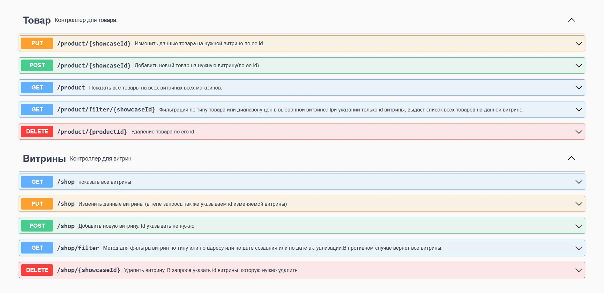
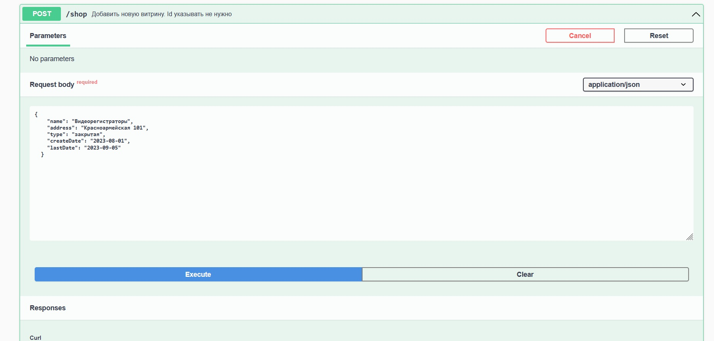
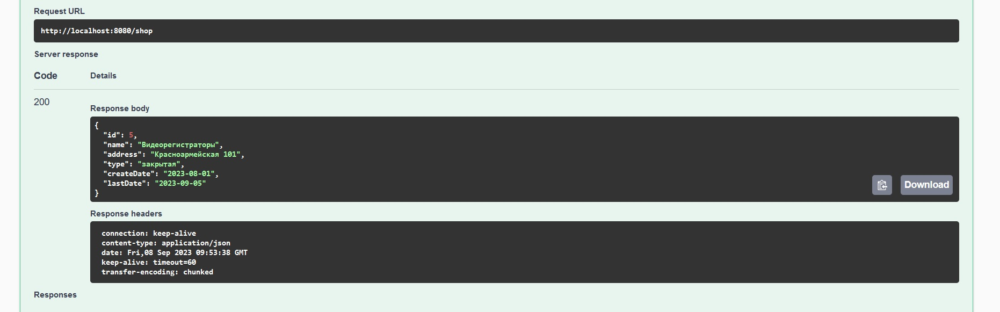
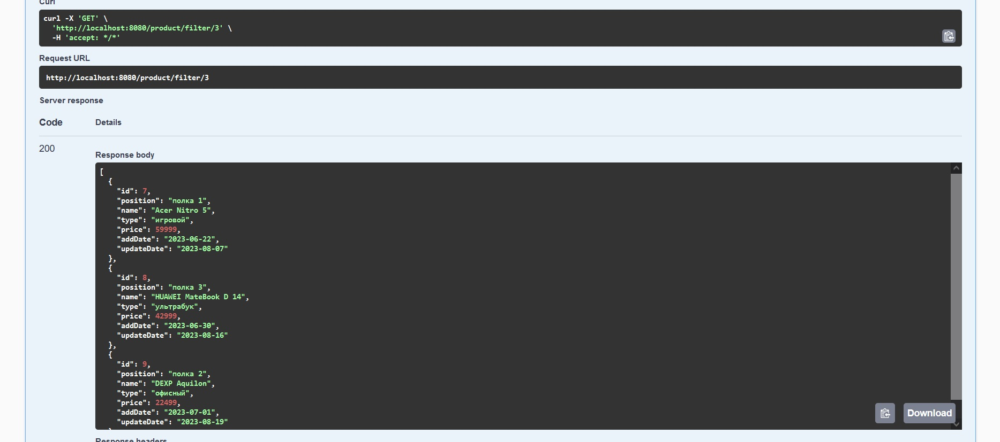
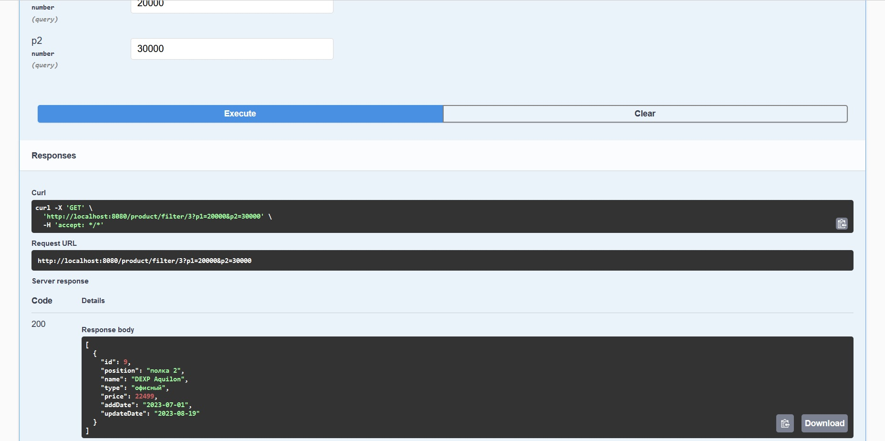

#### ТЕСТОВОЕ Java REST-сервис для хранения данных о витринах товаров в магазинах.
<br>

**Для запуска нужно:**

Java 8+, Maven 3+, PostgreSql 14, swagger-ui/Postman
- Создать в postgreSQL базу данных **shop** 
- Данные профиля по умолчанию root/root. В application.properties можно изменить на свои.


#### Запуск через IDE:

- В IDE:

 Подтянуть зависимости из pom-файла и:
````
Run class DeviceListApplication
````

#### Запуск из командной строки:

- В папке проекта запустить окно команд и:

````
mvn spring-boot:run 
````

#### Для выполнения запросов - swagger-ui (или постман):

http://localhost:8080/swagger-ui.html

##### Общий вид с кратким описанием методов:


Пример создания новой витрины:




Пример фильтрации:



В диапазоне цен в пределах одной витрины:

